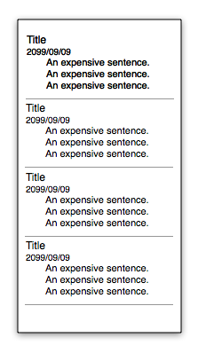
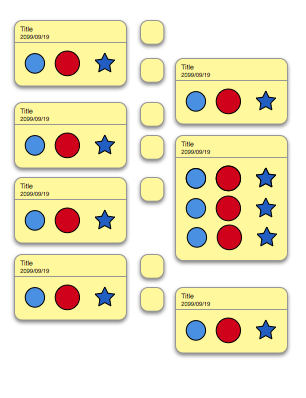
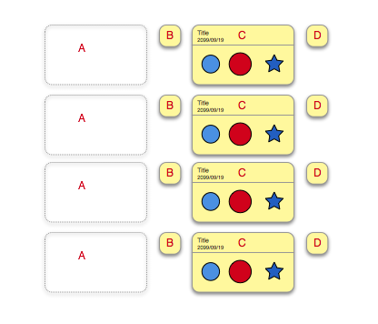
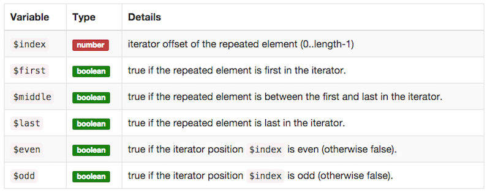
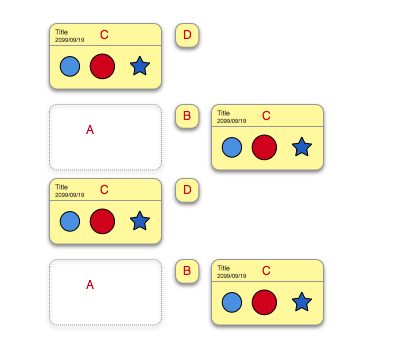
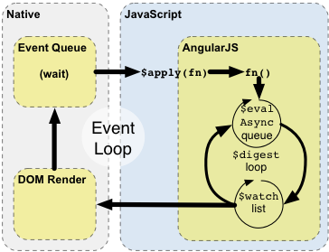

class: center, middle

# A journey in UI world with AngularJS in hand

Based on a true story.

---

class: center

### Once upon a time
We had a message-board-like component in our product



---

One day

--


--

"I want the board looks fancier"

--

.right[]

--

.right["No worry my lord! I got this."]

---

class: center



---


--

"This is my new design, make it happen."

--

.right[]

--

.right["No worry my lord! I got this."]

---

## Problems

--

- rendering of center blocks are expensive

--

- should avoid "using the ultimate jQuery to manually adjust elements in AngularJS"

--

## Tasks

--

- The [ Left <-> Right ] layout

--

- Adjusting distance between rows

---

# Left <-> Right



---

Built-in variables inside a scope of an ngRepeat:



---

# Left <-> Right

```html
<div ng-repeat="item in items">
    <div class="A" ng-show="$even"></div>
    <div class="B" ng-show="$even"></div>
    <div class="C"></div>
    <div class="D" ng-show="$odd"></div>
</div>
```

.right[]

---

# Demo

`step_1` and `step_2`

---

# Distance


---

```html
<outter>
    <first>
        <inner></inner>
    </first>
    <second></second>
</outter>
```

--

### Instantiation phases

- compile
- link

### Evaluated functions

- compile
- controller
- pre-link
- post-link

---

```html
<outter>
    <first>
        <inner></inner>
    </first>
    <second></second>
</outter>
```

### Evaluation orders (except compile)

- outter.controller
- outter.pre-link
    - first.controller
    - first.pre-link
        - inner.controller
        - inner.pre-link
        - inner.post-link
    - first.post-link
    - second.controller
    - second.pre-link
    - second.post-link
- outter.post-link

---

### Communications between nested directives and their father

```html
<outter>
    <first>
        <inner></inner>
    </first>
    <second></second>
</outter>
```


```javascript
// father directive
    app.directive('father', function () {
        return {
            controller: function () {
                this.sayHello = function (name) {
                    console.log('hello ' +  name);
                };
            }
        };
    });
// nested directive
    app.directive('son', function () {
        return {
            require: '^father',
            link: function (scope, element, attrs, fatherCtrl) {
                fatherCtrl.sayHello('James');
            } };
    });
```

---

Combine these two features, we can acheive the distance adjustment.

### Demo

`step_3`

---



So we need to put the distance adjustment in next loop, after the content of 
the DOM is rendered. 

### Demo

`step_4`


--- 

### The END

